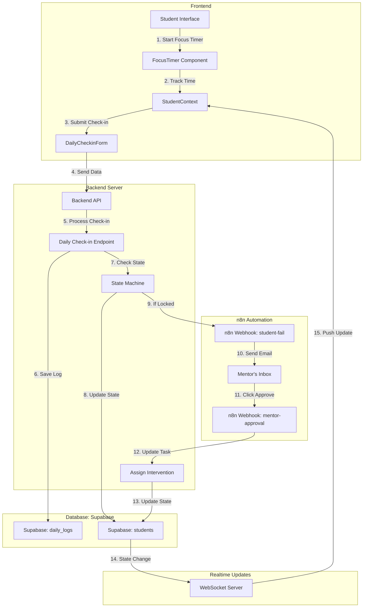
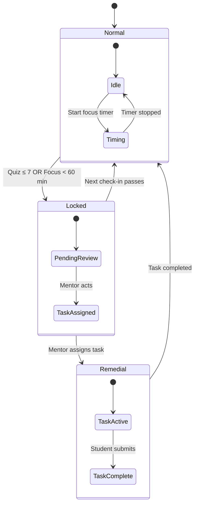

# Alcovia - Intervention Engine

A full-stack system that implements a closed-loop intervention workflow for student mentorship. This system connects a React frontend, Node.js backend, and n8n automation to manage student progress and mentor interventions in real-time.

## Live Demo

- **Frontend**: [https://alco-app.vercel.app](https://alco-app.vercel.app)
- **Backend API**: `https://alcovia-server.onrender.com/api`

## Features

- Real-time student status tracking (Normal, Locked, Remedial)
- Automated mentor notifications via n8n workflow
- Interactive frontend that responds to state changes
- Secure API endpoints for all student interactions

## Tech Stack

### Frontend
- React 18 with Vite
- React Router for navigation
- Tailwind CSS for styling
- WebSocket for real-time updates

### Backend
- Node.js with Express
- Supabase (PostgreSQL) for data persistence
- JWT for authentication
- WebSocket server for real-time communication

### System Architecture

### Complete Flow



### State Transitions



### Key Components

1. **Frontend**
   - React components with real-time state management
   - WebSocket connection for live updates
   - Tab visibility detection for focus tracking

2. **Backend**
   - RESTful API endpoints
   - State machine for student status
   - WebSocket server for real-time updates

3. **Database**
   - Students table with state tracking
   - Daily logs for check-ins
   - Interventions history

4. **Automation**
   - n8n workflow for mentor notifications
   - Email integration
   - Webhook handling

## Project Structure

```
alcovia-intervention/
├── client/               # React frontend
│   ├── public/           # Static assets
│   └── src/
│       ├── components/   # Reusable UI components
│       ├── context/      # Application state management
│       ├── hooks/        # Custom React hooks
│       ├── pages/        # Application screens
│       └── utils/        # Helper functions
│
├── server/               # Node.js backend
│   ├── api/             # Route handlers
│   ├── lib/             # Database and service layer
│   └── utils/           # Utility functions
│
└── n8n_workflow/         # Automation workflows
    └── intervention.json # n8n workflow export
```

## Prerequisites

- Node.js 18+
- npm 9+
- Supabase account with PostgreSQL database
- n8n account (cloud or self-hosted)
- Vercel account for deployment

## Environment Setup

### Backend (`.env`)
```env
# Supabase Configuration
SUPABASE_URL=your_supabase_url
SUPABASE_KEY=your_supabase_key

# Server Configuration
PORT=3001
NODE_ENV=production
JWT_SECRET=your_jwt_secret
N8N_WEBHOOK_URL=your_n8n_webhook_url
```

### Frontend (`.env`)
```env
VITE_API_BASE_URL=https://alcovia-server.onrender.com/api
VITE_WS_URL=wss://your-websocket-server.com
VITE_DEFAULT_STUDENT_ID=optional_student_id_for_demo
```

## Local Development

1. **Clone the repository**
   ```bash
   git clone https://github.com/yourusername/alcovia-intervention.git
   cd alcovia-intervention
   ```

2. **Set up the backend**
   ```bash
   cd server
   npm install
   cp .env.example .env
   # Update .env with your credentials
   npm run dev
   ```

3. **Set up the frontend**
   ```bash
   cd ../client
   npm install
   cp .env.example .env
   # Update .env with your API URL
   npm run dev
   ```

4. **Import n8n workflow**
   - Open your n8n instance
   - Import the workflow from `n8n_workflow/intervention.json`
   - Update webhook URLs in the workflow

## System Architecture

### State Management
- **Normal**: Student can access all features
- **Locked**: Triggered by poor performance (quiz_score ≤ 7 OR focus_minutes ≤ 60)
- **Remedial**: Mentor has assigned a task

### API Endpoints

#### Student Endpoints
- `POST /api/daily-checkin` - Submit daily metrics
- `GET /api/student/:id/status` - Get current status
- `POST /api/complete-task` - Mark task as complete

#### Mentor Endpoints
- `GET /api/students` - List all students
- `POST /api/assign-intervention` - Assign intervention task
- `GET /api/interventions` - View all interventions

### n8n Workflow
1. Trigger: Webhook from backend on student failure
2. Action: Send email notification to mentor
3. Wait: Mentor action (approve/reject)
4. Update: Backend with mentor's decision

## Fail-Safe Mechanism

To prevent indefinite lockout:
1. **Auto-unlock after 12 hours**
   - System automatically reverts to Normal state if no mentor action
   - Logs the incident for review

2. **Escalation Path**
   - If no response in 6 hours, notify secondary mentor
   - After 12 hours, auto-unlock with a generic intervention task

3. **Audit Trail**
   - All state changes are logged with timestamps
   - Mentors can review auto-unlock events

## Bonus Features Implemented

1. **Real-Time Updates**
   - WebSocket integration for instant status updates
   - No page refresh needed when mentor assigns intervention

2. **Focus Mode**
   - Tab visibility detection
   - Automatic session failure on tab switch/minimize
   - Penalty system for violations

## Deployment

### Backend
```bash
cd server
vercel --prod
```

### Frontend
```bash
cd client
vercel --prod
```

### n8n Workflow
1. Import `n8n_workflow/intervention.json` to your n8n instance
2. Update webhook URLs in the workflow
3. Configure email/Slack notifications

## Testing the Flow

1. **Trigger Lock State**
   - Submit a daily check-in with quiz_score ≤ 7 or focus_minutes ≤ 60
   - App should lock and show pending mentor review

2. **Mentor Action**
   - Check email for notification
   - Click intervention link to assign task

3. **Student Task**
   - App should show assigned task
   - Complete task to return to normal state
   - `normal`: focus timer + daily check-in form.
   - `locked`: polling card (“Waiting for mentor review…”).
   - `remedial`: assigned task card; “Mark Complete” calls `/complete-task`.
3. Student context persists ID in `localStorage` and polls `/student/:id` every 3s while locked.

## Troubleshooting

- **Health endpoint 404**: deploy backend or fix domain; every request must hit `/api/*`.
- **CORS errors**: ensure `VITE_API_BASE_URL` matches deployed server URL, including `/api`.
- **Supabase connect failure**: check `SUPABASE_URL`/`SUPABASE_KEY` logs emitted at startup.