# Student Progress Tracker API

A robust Node.js + Express backend for tracking student progress, managing interventions, and handling daily check-ins. Built with Supabase Postgres and designed for serverless deployment on Vercel.

## 🚀 Features

- **Student Management**: Create and manage student records
- **Daily Check-ins**: Track student progress with quiz scores and focus minutes
- **Automated State Management**: Automatic state transitions (normal → locked → remedial)
- **Intervention Workflow**: Assign and track interventions for at-risk students
- **Comprehensive API**: Well-documented RESTful endpoints
- **Webhook Integration**: Real-time notifications via n8n (optional)
- **Production Ready**: Built with security and scalability in mind

## 📋 Prerequisites

- Node.js 18.x or later
- npm or yarn
- Vercel CLI (`npm install -g vercel`)
- Supabase account with PostgreSQL database
- n8n account (for webhook notifications, optional)

## 🛠️ Setup

1. **Clone the repository**
   ```bash
   git clone <repository-url>
   cd <project-directory>/server
   ```

2. **Install dependencies**
   ```bash
   npm install
   ```

3. **Set up environment variables**
   - Copy `.env.example` to `.env`
   - Update the values with your Supabase credentials and other settings
   ```env
   SUPABASE_URL=your_supabase_url
   SUPABASE_KEY=your_supabase_key
   N8N_WEBHOOK_URL=your_n8n_webhook_url # Optional
   NODE_ENV=development
   ```

4. **Database Setup**
   - Create the following tables in your Supabase database:
     - `students`
     - `daily_logs`
     - `interventions`
   - Ensure all required columns and relationships are set up

## 🚀 Running Locally

```bash
# Start the development server
npm run dev

# The API will be available at http://localhost:3000
```

## 🌐 API Endpoints

### Health Check
- `GET /health` - Check API status

### Students
- `GET /students` - List all students
- `POST /students` - Create a new student
  ```json
  {
    "name": "John Doe"
  }
  ```
- `GET /student/:id` - Get student details

### Daily Check-in
- `POST /daily-checkin` - Submit daily progress
  ```json
  {
    "student_id": "uuid-here",
    "quiz_score": 8,
    "focus_minutes": 45
  }
  ```

### Interventions
- `POST /assign-intervention` - Assign an intervention
  ```json
  {
    "student_id": "uuid-here",
    "task": "Complete extra math exercises",
    "due_date": "2025-12-31"
  }
  ```
- `POST /complete-task` - Mark intervention as complete
  ```json
  {
    "intervention_id": "uuid-here",
    "student_id": "uuid-here"
  }
  ```

## 🚀 Deployment

1. **Deploy to Vercel**
   ```bash
   # Login to Vercel (if not already logged in)
   vercel login
   
   # Deploy
   vercel --prod
   ```

2. **Set environment variables** in Vercel dashboard

## 📊 State Management

Students can be in one of three states:
- **Normal**: Default state
- **Locked**: Automatically triggered by low quiz scores
- **Remedial**: After intervention is assigned

## 🔄 Webhook Integration

Configure the `N8N_WEBHOOK_URL` to receive notifications for:
- Student state changes
- Intervention assignments
- Task completions

## 🧪 Testing

Run tests with:
```bash
npm test
```

## 🤝 Contributing

1. Fork the repository
2. Create your feature branch (`git checkout -b feature/AmazingFeature`)
3. Commit your changes (`git commit -m 'Add some AmazingFeature'`)
4. Push to the branch (`git push origin feature/AmazingFeature`)
5. Open a Pull Request

## 📄 License

This project is licensed under the MIT License - see the [LICENSE](LICENSE) file for details.

## 🙏 Acknowledgments

- Built with ❤️ using Node.js, Express, and Supabase
- Deployed on Vercel
- Webhook integration with n8n

## 🏗️ Setup

1. **Clone the repository**
   ```bash
   git clone <repository-url>
   cd FocusLoop-alcoviai-assignment/server
   ```

2. **Install dependencies**
   ```bash
   npm install
   ```

3. **Environment Setup**
   ```bash
   cp .env.example .env
   ```
   Update the `.env` file with your credentials:
   ```
   SUPABASE_URL=your-supabase-url
   SUPABASE_KEY=your-supabase-anon-key
   N8N_WEBHOOK_URL=your-n8n-webhook-url
   PORT=3000
   NODE_ENV=development
   ```

4. **Database Setup**
   - Create a new Supabase project
   - Run the SQL schema from `database/schema.sql` in the SQL editor
   - Or use the Supabase dashboard to create tables manually

## 🚦 Running Locally

### Development Mode
```bash
# Install Vercel CLI if not already installed
npm install -g vercel

# Start development server
vercel dev
```

The API will be available at `http://localhost:3000`

### Production Mode
```bash
npm run build
npm start
```

## 🧪 Testing the API

### 1. Create a Test Student
```bash
curl -X POST 'http://localhost:3000/api/students' \
  -H 'Content-Type: application/json' \
  -d '{"name": "Test Student"}'
```

### 2. Test Daily Check-in
#### Successful Check-in (Good scores)
```bash
curl -X POST 'http://localhost:3000/api/daily-checkin' \
  -H 'Content-Type: application/json' \
  -d '{
    "student_id": "YOUR_STUDENT_ID",
    "quiz_score": 8,
    "focus_minutes": 65
  }'
```

#### Needs Intervention (Low scores)
```bash
curl -X POST 'http://localhost:3000/api/daily-checkin' \
  -H 'Content-Type: application/json' \
  -d '{
    "student_id": "YOUR_STUDENT_ID",
    "quiz_score": 5,
    "focus_minutes": 30
  }'
```

### 3. Assign Intervention (via n8n webhook or manually)
```bash
curl -X POST 'http://localhost:3000/api/assign-intervention' \
  -H 'Content-Type: application/json' \
  -d '{
    "student_id": "YOUR_STUDENT_ID",
    "task": "Complete additional exercises on algebra"
  }'
```

### 4. Complete Task
```bash
curl -X POST 'http://localhost:3000/api/complete-task' \
  -H 'Content-Type: application/json' \
  -d '{
    "intervention_id": "YOUR_INTERVENTION_ID"
  }'
```

### 5. Get Student Status
```bash
curl 'http://localhost:3000/api/student/YOUR_STUDENT_ID'
```

## 📚 API Reference

### POST /api/daily-checkin
Record a student's daily check-in.

**Request Body:**
```json
{
  "student_id": "uuid",
  "quiz_score": 0-10,
  "focus_minutes": number
}
```

### POST /api/assign-intervention
Assign an intervention to a student.

**Request Body:**
```json
{
  "student_id": "uuid",
  "task": "string"
}
```

### POST /api/complete-task
Mark an intervention as completed.

**Request Body:**
```json
{
  "intervention_id": "uuid"
}
```

### GET /api/student/:id
Get student details and status.

## 🔄 State Machine

The student state transitions are managed as follows:

```mermaid
stateDiagram-v2
    [*] --> normal
    normal --> locked: quiz_score ≤ 7 OR focus_minutes ≤ 60
    locked --> normal: quiz_score > 7 AND focus_minutes > 60
    locked --> remedial: When intervention is assigned
    remedial --> normal: When intervention is completed
```



## 🚀 Deployment

1. **Vercel Deployment**
   ```bash
   # Login to Vercel
   vercel login
   
   # Deploy
   vercel --prod
   ```

2. **Environment Variables**
   Make sure to set all required environment variables in your Vercel project settings.

## 📦 Dependencies

- Express.js - Web framework
- @supabase/supabase-js - Database client
- serverless-http - For Vercel serverless functions
- cors - For handling CORS
- dotenv - For environment variables

## 🔍 Debugging

Set `NODE_ENV=development` to see detailed error messages in responses.

## 📝 Notes

- The API is stateless and designed for serverless deployment
- All timestamps are in UTC
- Database indexes are optimized for common queries
- The system is designed to be extended with additional features like authentication

## 📄 License

This project is licensed under the MIT License.
